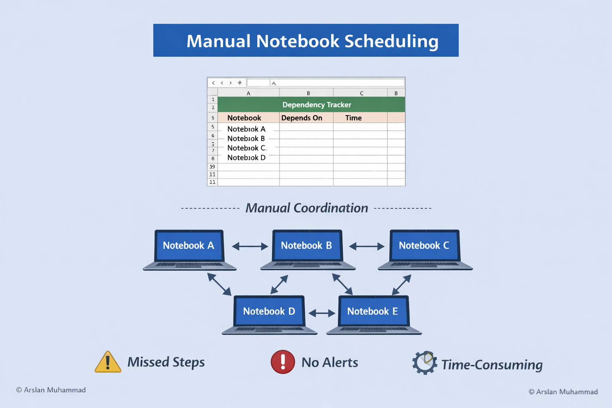
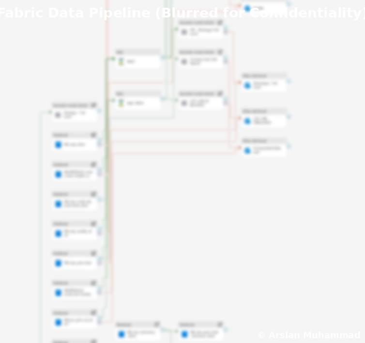
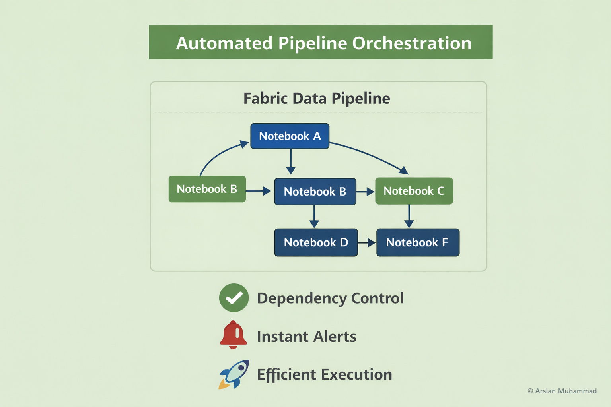

# 🔹 Enterprise Data Pipeline Orchestration (Microsoft Fabric)

Automating notebook execution, dependency management, and enterprise data refresh workflows.

---

### 🧩 Problem / Before

As part of the transition from a server-based ERP to cloud-based systems, data transformations were implemented using **100+ notebooks** with independently scheduled refreshes.

However, orchestration was completely manual and difficult to maintain.

- Notebook dependencies were tracked manually in **Excel sheets**
- Execution order had to be **monitored and adjusted manually**
- Multiple **branching dependencies** increased complexity
- No built-in **failure detection or alerting system**
- Issues were often identified **only after business users reported incorrect data**
- Daily effort required **hours of manual validation and coordination**

**Example:**
- Notebook A feeds B and C  
- Notebook B feeds D, while C feeds E and F  
- Any upstream failure required **manual tracing across multiple branches**

  
   
  <em>Manual notebook scheduling vs automated pipeline orchestration</em>

---

### ⚙️ Solution & Approach

#### 1️⃣ Data Transformation Layer
- Converted ERP tables into **Python / SQL notebooks**
- Established modular and reusable data processing units
- Enabled scalable transformations across datasets

#### 2️⃣ Orchestration Challenge
- Manual scheduling caused **dependency conflicts**
- No centralized visibility into execution flow
- High operational overhead for daily maintenance

#### 3️⃣ Pipeline Implementation
- Designed and implemented centralized orchestration using Microsoft Fabric pipelines
- Defined **explicit dependencies across 100+ notebooks**
- Automated execution across **multiple branching paths**
- Ensured correct sequencing of upstream and downstream processes

#### 4️⃣ Monitoring & Alerts
- Introduced **automated failure detection**
- Configured **real-time alerts and notifications**
- Enabled proactive issue resolution before business impact

#### 5️⃣ End-to-End Integration
- Integrated pipelines with **Bronze layer ingestion**
- Established seamless data flow:
  - Bronze → Notebooks → Silver/Gold layers  
- Connected outputs to **semantic models and Power BI reporting**

### 🧠 Technical Flow & Architecture

  
   
  <em>Data Pipeline Sample, Blurred for Confidentiality</em>

*⚠️ Note: This is **sample pipeline** to illustrate the approach. For the full concept or discussion, feel free to reach out on [LinkedIn](https://www.linkedin.com/in/arslan-muhammad-ccba-meng-eit-94a21461/).*

---

### 📊 Impact / Results

- ⚡ Eliminated **manual dependency tracking (Excel-based scheduling removed)**
- ⏱ Reduced daily operational effort from **hours → fully automated workflows**
- 🔁 Ensured accurate execution across **complex multi-branch dependencies**
- 🚨 Enabled **real-time failure alerts and proactive issue resolution**
- 📊 Improved **data reliability and trust across business users**
- 🏢 Established a scalable orchestration framework for enterprise data pipelines

  
   
  <em>End-to-end pipeline orchestration integrating ingestion, transformation, and reporting layers</em>

---

### 🧠 Key Challenges & Learnings

- 🔀 Managing **complex multi-branch dependencies across 100+ notebooks**
- 🔄 Transitioning from **manual scheduling → automated orchestration**
- 🚨 Implementing **reliable failure detection and alerting mechanisms**
- 🔗 Integrating pipelines with existing **data architecture (Bronze → Gold)**

---

### 🛠️ Tech Stack

- Microsoft Fabric (Data Pipelines)  
- Python (Notebooks)  
- SQL  
- Power BI (Semantic Models & Reporting)  

© Arslan Muhammad

