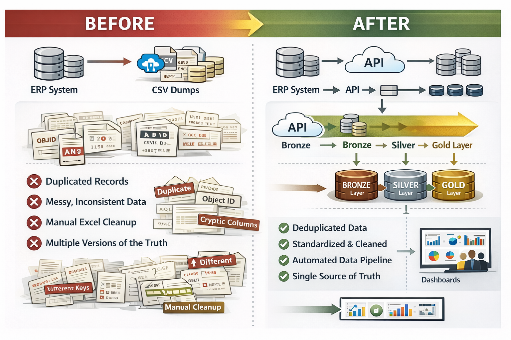
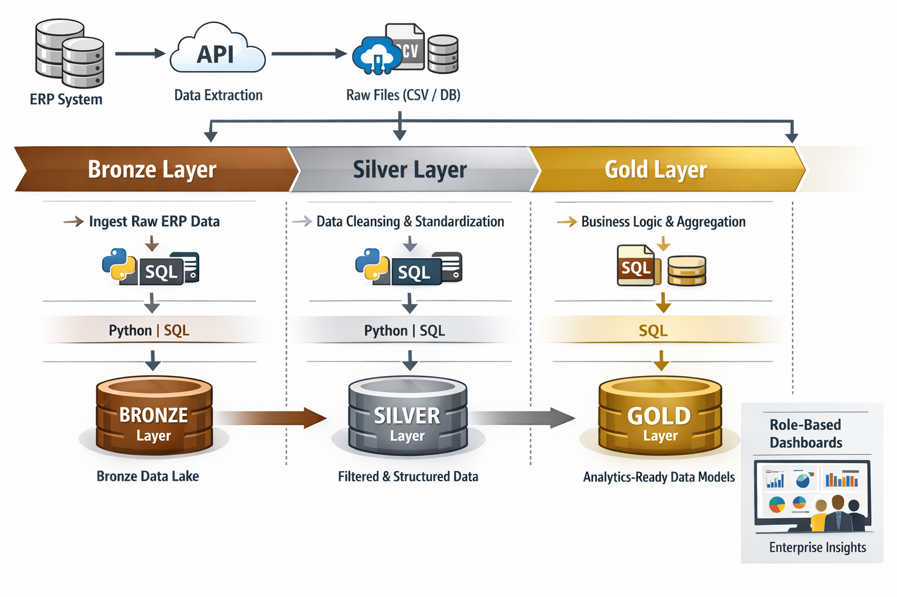

# 🔹 Enterprise ERP Data Platform (Medallion Architecture)

Transforming raw ERP data into a scalable, analytics-ready platform.

---

### 🧩 Problem / Before

Enterprise data from the ERP system was fragmented, inconsistent, and not suitable for analytics. Teams relied on manual extraction and transformation, leading to inefficiencies and low data trust.

- Raw ERP extracts contained **technical and non-business fields** (e.g., object IDs)
- Significant **data duplication across multiple datasets**
- Inconsistent **keys, naming conventions, and formats**
- Heavy reliance on **manual SQL / Excel transformations**
- No centralized or standardized data model across teams

  
   
  <em>Transformation from fragmented ERP extracts to a structured Medallion data platform</em>

---

### ⚙️ Solution & Approach

Designed and implemented a scalable **Enterprise Data Platform using Medallion Architecture (Bronze → Silver → Gold)** to standardize and transform ERP data into analytics-ready datasets.

1️⃣ Data Extraction & Ingestion (ERP → Bronze)

 

- Extracted ERP data via APIs and stored raw outputs into structured files (CSV/DB) for ingestion.
- API-based ingestion pipeline
- Preserved raw data fidelity for traceability
- Scaled to hundreds of millions of records

<pre><code class="language-python">
# Pseudo representation
df_raw = extract_from_api("ERP_ENDPOINT")

df_raw.write.format("csv").save("/bronze/raw_erp_data/")

</code></pre>

2️⃣ Data Cleaning & Standardization (Bronze → Silver)
 
  
 

- Removed non-business fields (OBJ IDs, system fields)
- Eliminated duplicate records
- Standardized:
- date formats
- numeric precision
- string consistency
- Resolved inconsistent keys and naming conventions

<pre><code class="language-python">
df_clean = df_raw.drop("OBJ_ID", "TECH_FIELD")

df_clean = df_clean.withColumn("date", F.to_date("date"))
df_clean = df_clean.dropDuplicates()

</code></pre>

 

3️⃣ Business Logic & Data Modeling (Silver → Gold)
 
  
 

- Transformed cleaned datasets into business-ready models for enterprise reporting.
- Built aggregated, analytics-ready datasets
- Applied business logic and transformations
- Created a single source of truth

<pre><code class="language-sql">
SELECT 
    customer_id,
    SUM(order_amount) AS total_revenue,
    COUNT(order_id) AS total_orders
FROM silver_orders
GROUP BY customer_id

</code></pre>

*⚠️ Note: This is **pseudo code** to illustrate the approach. For the full concept or discussion, feel free to reach out on [LinkedIn](https://www.linkedin.com/in/arslan-muhammad-ccba-meng-eit-94a21461/).* 

### 🧠 Technical Flow & Architecture

    <em>End-to-end ERP data flow from extraction to analytics consumption</em> 

---

### 📊 Impact / Results
- 📦 Processed ~700M–1B records (~200–800 GB of data)
- ⚡ Significantly reduced manual data preparation effort
- 🔁 Eliminated duplication and improved data consistency
- 📊 Enabled faster and more reliable reporting
- 🏢 Established a single source of truth across the enterprise

---

### 🧠 Key Challenges & Learnings
- 🔁 Addressed excessive data duplication through optimized transformations
- 🔑 Standardized inconsistent keys and terminology across datasets
- 🧹 Transformed raw ERP data into business-consumable formats
- 🏗 Designed a scalable architecture from scratch for enterprise use

---

### Tech Stack
- Python
- SQL
- REST APIs
- File-based Data Lake
- Medallion Architecture
