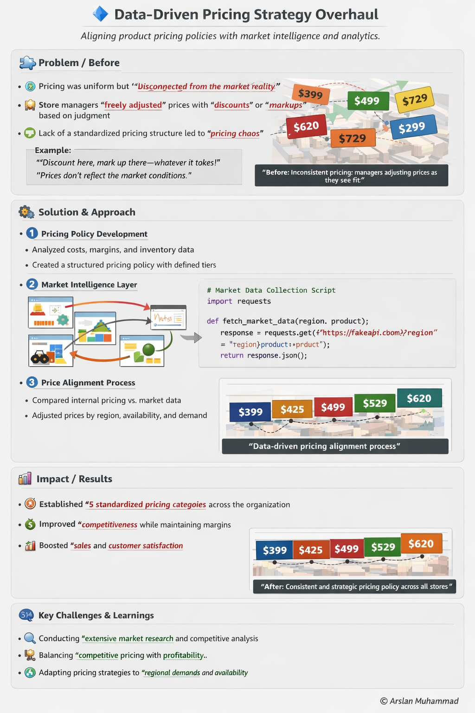

### 🔹 Pricing Policy Standardiation (Generated $22M additional revenue)
Standardizing pricing across 60 stores for agriculture and construction equipment parts, using data-driven methods and market intelligence.

---

## 🧩 Problem / Before

Pricing was centrally controlled but **failed to reflect real market conditions**.  
Store managers frequently overrode prices based on intuition.

### Key Issues

- ❌ Official pricing misaligned with market reality  
- ❌ Manual discounts/markups caused **margin inconsistencies**  
- ❌ No structured visibility into **competitor pricing or demand**  
- ❌ Decisions were **reactive, inconsistent, and localized**

### 📌 Example

| Part   | Official Price | Store A | Store B | Market |
|--------|--------------|--------|--------|--------|
| Part X | $1,200       | $1,150 | $1,300 | $1,180 |
| Part Y | $850         | $900   | $820   | $870   |
| Part Z | $2,400       | $2,500 | $2,350 | $2,380 |

> 📉 Result: Pricing inconsistency across locations and lost margin opportunities
 
---

## ⚙️ Solution & Approach

### 1️⃣ Policy Design Layer

- Partnered with **Director, VP, and President**
- Defined pricing strategy using:
  - Margin targets  
  - Landed cost  
  - Storage & obsolescence risk  
- Integrated **historical sales + business expertise**

---
### 2️⃣ Market Intelligence Layer

- 📡 Automated competitor price collection
- 🌍 Region-based pricing intelligence
- 🔗 Integrated with internal cost & sales data
  

2️⃣ Full Pseudo Concept Code 

 

<pre><code class="language-python">
# 🔹 Enterprise Pricing Policy Automation & Market Intelligence
# © Arslan Muhammad

import requests
import pandas as pd

# -----------------------------
# CONFIGURATION
# -----------------------------
products = ["Part X", "Part Y", "Part Z"]
stores = ["Store A", "Store B", "Store C"]
competitor_urls = {
    "CompetitorA": "https://api.competitora.com/prices",
    "CompetitorB": "https://api.competitorb.com/prices"
}

# -----------------------------
# FUNCTION TO FETCH MARKET PRICES
# -----------------------------
def fetch_market_price(product):
    market_data = []
    for competitor, url in competitor_urls.items():
        # pseudo API call to fetch price for product
        response = requests.get(url, params={"product": product})
        if response.status_code == 200:
            price = response.json().get("price")
            market_data.append({"Competitor": competitor, "Product": product, "Price": price})
        else:
            # fallback pseudo price
            market_data.append({"Competitor": competitor, "Product": product, "Price": None})
    return market_data

# -----------------------------
# AGGREGATE MARKET DATA
# -----------------------------
all_market_data = []
for product in products:
    all_market_data.extend(fetch_market_price(product))

df_market = pd.DataFrame(all_market_data)

# -----------------------------
# INTERNAL COST DATA (pseudo)
# -----------------------------
df_internal = pd.DataFrame({
    "Product": products * len(stores),
    "Store": [s for s in stores for _ in products],
    "OfficialPrice": [1200, 850, 2400, 1200, 850, 2400, 1200, 850, 2400],
    "Cost": [900, 650, 2000, 900, 650, 2000, 900, 650, 2000],
    "Sales": [100, 200, 50, 120, 180, 60, 90, 210, 55]
})

# -----------------------------
# MERGE INTERNAL WITH MARKET
# -----------------------------
df_merged = df_internal.merge(df_market.groupby("Product")["Price"].mean().reset_index(),
                              on="Product",
                              how="left").rename(columns={"Price": "MarketPrice"})

# -----------------------------
# CALCULATE SUGGESTED PRICE ADJUSTMENTS
# -----------------------------
df_merged["SuggestedPrice"] = df_merged.apply(
    lambda x: max(x["Cost"] * 1.15, x["MarketPrice"]) if pd.notnull(x["MarketPrice"]) else x["OfficialPrice"],
    axis=1
)

# -----------------------------
# ASSIGN TO STANDARDIZED CATEGORIES (5 tiers)
# -----------------------------
def pricing_category(price):
    if price < 500:
        return "Tier 1"
    elif price < 800:
        return "Tier 2"
    elif price < 1200:
        return "Tier 3"
    elif price < 2000:
        return "Tier 4"
    else:
        return "Tier 5"

df_merged["PricingCategory"] = df_merged["SuggestedPrice"].apply(pricing_category)

# -----------------------------
# SIMULATE IMPACT
# -----------------------------
# Revenue = SuggestedPrice * Sales
df_merged["ProjectedRevenue"] = df_merged["SuggestedPrice"] * df_merged["Sales"]

# Total Revenue Impact (pseudo for FY 2022-2023)
total_revenue_impact = df_merged["ProjectedRevenue"].sum()
print(f"Projected Revenue for 2022-2023: ${total_revenue_impact:,.0f} (without additional investments)")

# -----------------------------
# OUTPUT SUMMARY
# -----------------------------
summary = df_merged[["Product", "Store", "OfficialPrice", "MarketPrice", 
                     "SuggestedPrice", "PricingCategory", "ProjectedRevenue"]]

print(summary)

# ✅ Impact:
# - $22M estimated increase in revenue (Finance Report FY 2022-2023)
# - Standardized pricing across all stores
# - Data-driven adjustments based on market intelligence
# - Minimal operational investment, significant strategic gains
</code></pre>

  
*⚠️ Note: This is **pseudo code** to illustrate the approach. For the full concept or discussion, feel free to reach out on [LinkedIn](https://www.linkedin.com/in/arslan-muhammad-ccba-meng-eit-94a21461/).*

### 3️⃣ Data-Driven Pricing Adjustments

Pricing decisions were driven by:

- Market intelligence signals
- Geographic location
- Product availability
- Demand & sales history
- Standard parts pricing catalog

### 4️⃣ Policy Implementation
Designed 5 standardized pricing categories

- Validated using:
    - Simulation models
    - Market comparison analysis
    - Iteratively aligned with executive leadership
 
### 🧠 Technical Flow & Architecture

  
   
  <em>Complete pricing policy flow</em>

---

### 📊 Impact / Results

- ⚡ Standardized pricing across 60+ stores
- 💰 Contributed to $22M revenue increase (2022–2023)
- 📈 Improved margin optimization through market alignment
- 🌎 Enabled geo-based dynamic pricing strategies
- ⏱ Reduced manual decision-making effort significantly
- 🏆 Empowered leadership with centralized pricing control

---

### 🧠 Key Challenges & Learnings
- 🔀 Translating store-level flexibility into centralized policy
- 📊 Combining market data with internal cost structures
- 🛠 Scaling multi-source data automation (APIs + internal systems)
- 🤝 Achieving executive alignment while preserving agility

---

### 🛠️ Tech Stack
- Python → Automation engine, API integration
- VBA → Cost processing & legacy system support
- Power BI (DAX) → Dashboards & analytics
- Excel → Data validation & financial modeling

---

📌 Key Takeaway
Transitioned pricing from intuition-based decisions to a data-driven, scalable, and market-aligned enterprise system

© Arslan Muhammad

