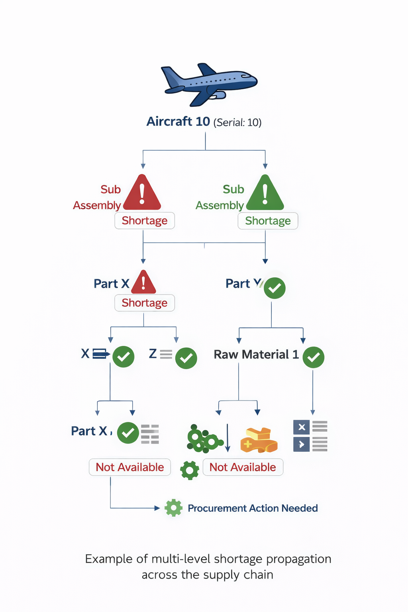
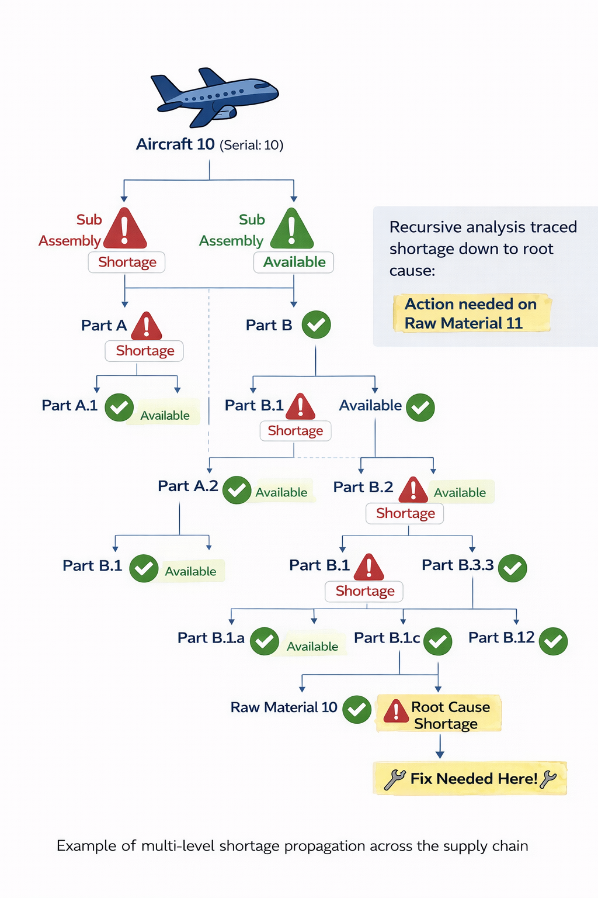

### 🔹 Supply Chain Insight Engine

### 🧩 Problem / Before
Supply chain visibility across the organization was highly fragmented. Analysts relied on manual ERP data extraction from multiple sources, making it difficult to understand end-to-end dependencies.

- Tracing the full supply-demand structure for a single part could take **10+ minutes**
- No centralized view of **multi-level assemblies or aircraft-level impact**
- Limited ability to identify **shortages and downstream impacts**
- Planning, procurement, financial and operations decisions were often incomplete/delayed

  **Example:**
  - An aircraft (Serial: 10) requires 10 sub-assemblies and 2 sub-assemblies have shortages (A,B)
  - Sub-assembly A requires 100 Parts and 3 are not available (X,Y,Z)
  - Assembly X requires 50 more parts and 2 of the raw materials are missing (1,2)
  - Procurement needs to take action to raw material 1 and 2 to avoid all the shortage for Aircraft 10 (Sub Assembly A)
 
    

     
      
    

---

### ⚙️ Solution & Approach
Developed a scalable **Supply Chain Insight Engine** that reconstructs the complete supply-demand network across the enterprise (Expland for Pseudo Code)

1️⃣ Consolidate All Demand & Supply

- Sources included: Customer Orders (CO), Sales Orders (SO), Work Orders (WO), Planned Orders (PO/PL), Stock, Reservations, Inter-site transfers

python
# Consolidate all demand and supply
df_demand = spark.sql("SELECT part_id, demand_qty, demand_date FROM demand_tables")
df_supply = spark.sql("SELECT part_id, supply_qty, supply_date FROM supply_tables")
df_all = df_demand.join(df_supply, on="part_id", how="left")

 
 
2️⃣ Replicate ERP Logic for Alignment

Aligns demands with appropriate supplies based on priority: Stock → Shop/Purchase Orders → Planned Orders → No Supply

# Align supplies to demands by priority
df_aligned = df_all.withColumn(
    "allocated_qty",
    F.least(F.col("demand_qty"), F.col("supply_qty"))
).withColumn(
    "remaining_shortage",
    F.col("demand_qty") - F.col("allocated_qty")
)

 
 
3️⃣ Recursive Supply Chain Mapping

Traverse from final aircraft assembly down to raw materials
Tracks multi-level shortages
Stops recursion when no further demand exists

# Recursive supply chain mapping
df_anchor = df_aligned.filter(F.col("parent_assembly").isNull())

def map_supply_chain(df_current, max_depth=10):
    df_result = df_current
    for level in range(max_depth):
        df_next = df_result.join(
            df_aligned, df_result.part_id == df_aligned.parent_assembly, "left"
        )
        df_next = df_next.withColumn(
            "total_shortage",
            F.col("remaining_shortage") + F.coalesce(F.col("child_remaining_shortage"), 0)
        )
        df_next = df_next.filter(F.col("remaining_shortage") > 0)
        if df_next.count() == 0: break
        df_result = df_next
    return df_result

df_supply_chain_map = map_supply_chain(df_anchor) 

*⚠️ Note: This is **pseudo code** to illustrate the approach. For the full code or discussion, feel free to reach out on [LinkedIn](https://www.linkedin.com/in/arslan-muhammad-ccba-meng-eit-94a21461/).*
---

### 🧠 Technical Flow & Architecture

  
   
  <em>End-to-end supply chain engine integrating multi-facility flows, internal manufacturing, and external procurement</em>

---

### 📊 Impact / Results

- ⏱ Reduced analysis time from **10+ minutes per part → near-instant insights**
- 🔍 Enabled full **end-to-end supply chain visibility**
- ⚠️ Proactively identified **shortages and impacted assemblies**
- 🏭 Improved decision-making across:
  - Planning
  - Procurement
  - Operations / workforce allocation
- 🔄 Scalable engine supporting **thousands of aircraft and scenario variants**

    

     
      
    

