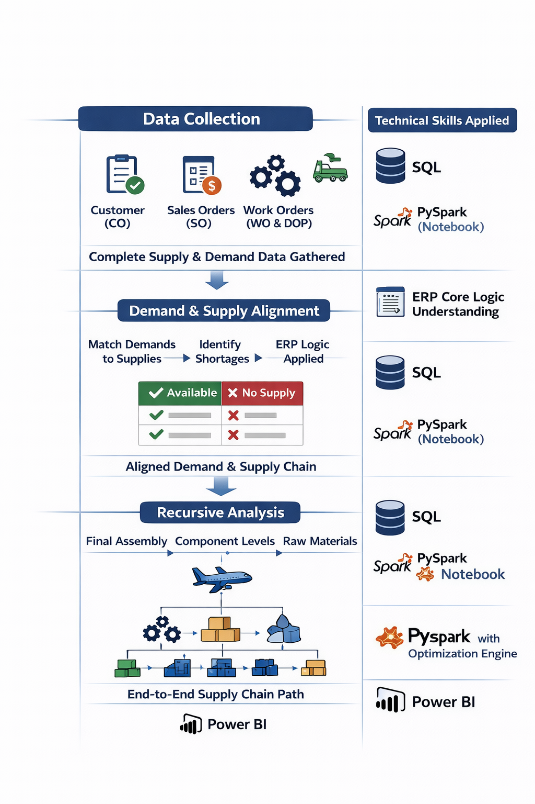

### 🔹 Supply Chain Insight Engine

### 🧩 Problem / Before
Supply chain visibility across the organization was highly fragmented. Analysts relied on manual ERP data extraction from multiple sources, making it difficult to understand end-to-end dependencies.

- Tracing the full supply-demand structure for a single part could take **30+ minutes**
- No centralized view of **multi-level assemblies or aircraft-level impact**
- Limited ability to identify **shortages and downstream impacts**
- Planning, procurement, and operations decisions were often delayed

---

### ⚙️ Solution / Approach / Technical Flow & Skills Applied
Developed a scalable **Supply Chain Insight Engine** that reconstructs the complete supply-demand network across the enterprise.

- Consolidated all demand and supply sources:
  - Customer Orders (CO), Sales Orders (SO)
  - Work Orders (WO), Planned Orders (PO/PL)
  - Stock, Reservations, Inter-site transfers
- Replicated ERP logic to **align demands with appropriate supplies**
- Built a **recursive PySpark model** to traverse from final aircraft assembly down to raw material level
- Enabled **critical path and shortage impact analysis** across multiple facilities and supply sources
- Published results in **Power BI** for real-time, organization-wide visibility

---

### 📊 Impact / Results

- ⏱ Reduced analysis time from **30+ minutes per part → near-instant insights**
- 🔍 Enabled full **end-to-end supply chain visibility**
- ⚠️ Proactively identified **shortages and impacted assemblies**
- 🏭 Improved decision-making across:
  - Planning
  - Procurement
  - Operations / workforce allocation
- 🔄 Scalable engine supporting **thousands of aircraft and scenario variants**

---

### 🛠 Tech Stack
`SQL` • `PySpark (Notebook)` • `ERP Logic Modeling` • `Recursion Optimization` • `Power BI`
